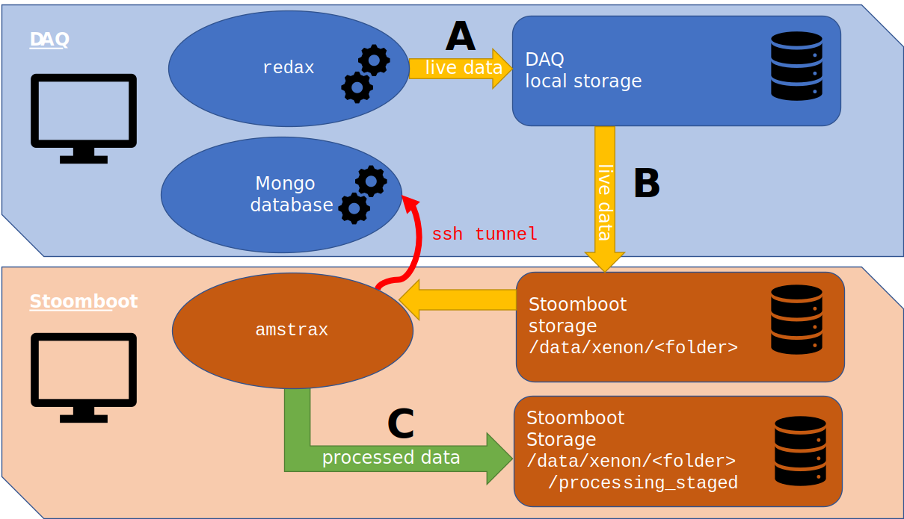

============================
Auto processing on stoomboot
============================

This document describes the dataflow for XAMS and XAMSL data.

---------------
DAQ - ``redax``
---------------

Important to note is that the data is collected with
`redax <https://github.com/XAMS-nikhef/redax>`_.
``redax`` runs on the "DAQ-machine". We assume that this collection of
data is fully seperated from the processing (as it should be). 
Additionally, the DAQ host also hosts the ``mongo database``. This
is where we store information about the runs.

Workflow
--------
Below we added a diagram of how the dataflow is organized. The data is 
read from the digitizers by
redax which writes it to some local storage (``A``). From that local
storage, one has to transfer this
data to stoomboot, e.g. using ``rsync`` (step ``B``)
to some ``<folder>`` on ``/data/xenon``. This folder may depend on which

As soon as the data is on stoomboot, one can auto process the data 
(more details below). To know
which runs there are, we need to have ``ssh tunnel`` to the DAQ-host.
We described the requirements
for the ssh tunneling in the setup of this documentation.

Required user input
------------------------------

Right now, we did not automize step ``B``. E.g. one can run this command
to transfer a single run:

.. code-block:: bash

    rsync -a -e ssh xams:/media/xams/Elements/xams/000932 /data/xenon/xamsl/live_data/.

You will notice that ``<folder>`` in the diagram above is ``xamsl/live_data``
in this example.

Processing on stoomboot (``C``)
-------------------------------

To process the data from ``xamsl/live_data`` for a single run, one would
have to do:

.. code-block:: bash

    cd <amstrax_installation_folder>/amstrax/auto_processing
    python amstraxer.py <run_id> --target raw_records_v1730 # Use --help to get more info

**NB!** This processed data to ``./amstrax_data`` and runs on the login
node of stoomboot, you should not do this (only perhaps to test a few 
things).

Now, we'd like to do this a bit more automated and running on stoomboot, to this end do:

.. code-block:: bash

    cd <amstrax_installation_folder>/amstrax/auto_processing
    python submit_stbc.py <run_id> --target raw_records_v1730 # Use --help to get more info

**NB!** This processed data to ``/data/xenon/xamsl/processing_stage`` you
may want to move the data somewhere else if it finished!

Automated submits
------------------------------
Now the real magic happens if you want to process all of it. To this end
set in the rundoc

.. code-block:: python

    {'processing_status': 'pending'}

for all the runs you would want to process. Now, we can start making 
the data using:

.. code-block:: bash

    cd <amstrax_installation_folder>/amstrax/auto_processing
    python auto_processing.py --target desired_target

This will automatically submit jobs for where the processing status is 
``'pending'`` for. It will
update the runs-collection ``'processing_status'`` (also if it fails) so
you can easily monitor the
progress.
`
**NB!** This processed data to ``/data/xenon/xamsl/processing_stage`` you
may want to move the data somewhere else if it finished!

Automated submits - advanced
------------------------------

Let's assume all the above seemed trivial, let's go one step further.

First, let's automate step ``A`` by automatically transferring data as
soon as it finished processing
on the DAQ to stoomboot after which you will set the
``'processing_status'`` to ``'pending'`` for this run.

Next open a screen (on stoomboot): ``screen -S auto_process`` and do

.. code-block:: bash

    cd <amstrax_installation_folder>/amstrax/auto_processing
    python submit_stbc.py --run_id <run_id> --target raw_records_v1730 # Use --help to get more info

exit the screen and enjoy data being automatically being processed for 
you. Keep in mind to not
change the ``'processing_status'`` anymore, we will do a lot of useless
jobs otherwise.

**NB!** This processed data to ``/data/xenon/xamsl/processing_stage`` you
may want to move the data somewhere else if it finished!

-----------------------------------
What does auto processing NOT do?
-----------------------------------
There are a few things that we dit not automate, either because we think
it's better if the user does it, or we do it for safety reasons (e.g.
data loss due to assumed perfect code).

Auto processing:
 - Does not do data management. The user is to a large degree responsible for this.
 - Transfer data from the DAQ to stoomboot (see step ``B``).